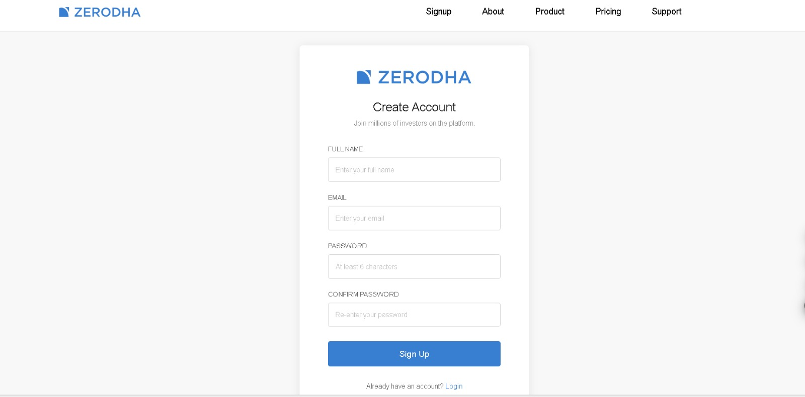
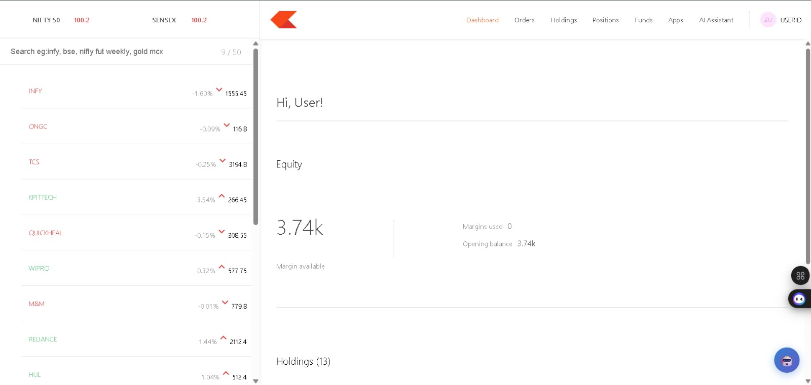
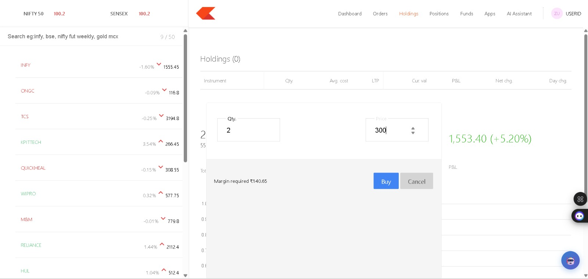
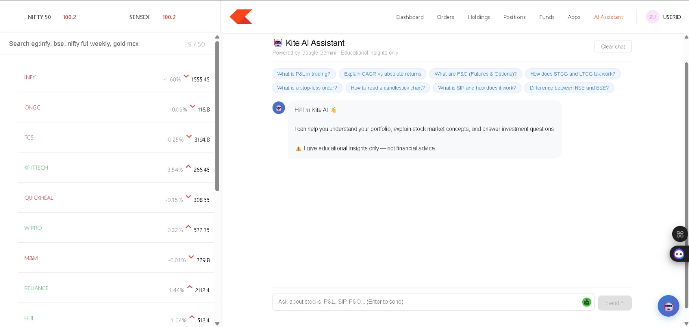

# 🤖 AI-Enhanced Zerodha Clone

<p align="left">


</p>

> A full-stack MERN-based stock trading platform inspired by Zerodha with an integrated AI-powered Stock Assistant for educational investment guidance and portfolio insights.

---

# ✨ Features

- 🔐 JWT Authentication
- 👤 Secure User Registration & Login
- 📊 Interactive Portfolio Dashboard
- 💹 Holdings & Positions Management
- 💰 Buy & Sell Stock Simulation
- 📈 Portfolio Analytics
- 🤖 AI Stock Assistant (Cohere API)
- ☁️ MongoDB Atlas Integration
- 🔒 Password Hashing with bcrypt
- 📱 Responsive User Interface

---

# 📸 Project Screenshots

## 🔐 Login Page

<p align="center">
  
</p>

---

## 📊 Dashboard

<p align="center">
  
</p>

---

## 💹 Holdings

<p align="center">
  
</p>

---

## 🤖 AI Stock Assistant

<p align="center">
  
</p>

---

# 🛠 Tech Stack

| Category | Technologies |
|----------|--------------|
| 🎨 Frontend | React.js, HTML5, CSS3, JavaScript |
| ⚙️ Backend | Node.js, Express.js |
| 🗄️ Database | MongoDB Atlas, Mongoose |
| 🔐 Authentication | JWT, bcrypt |
| 🤖 AI Integration | Cohere API |
| 🌐 API | REST API |
| 📡 HTTP Client | Axios |
| 🧰 Development Tools | Git, GitHub, VS Code |

---

# 📂 Folder Structure

```text
AI-Enhanced-Zerodha-Clone
│
├── assets
│   ├── login.jpeg
│   ├── dashboard.jpeg
│   ├── holdings.jpeg
│   └── aiassistant.jpeg
│
├── backend
├── dashboard
├── frontend
├── package.json
└── README.md
```

---

# 🚀 Getting Started

## 1️⃣ Clone the Repository

```bash
git clone https://github.com/MalempatiGnapika/ai-enhanced-zerodha-clone.git
```

```bash
cd ai-enhanced-zerodha-clone
```

---

## 2️⃣ Install Dependencies

### Backend

```bash
cd backend
npm install
```

### Frontend

```bash
cd ../frontend
npm install
```

### Dashboard

```bash
cd ../dashboard
npm install
```

---

## ▶️ Run the Project

### Start Backend

```bash
cd backend
node index.js
```

### Start Frontend

```bash
cd frontend
npm start
```

### Start Dashboard

```bash
cd dashboard
npm start
```

---

# 🔑 Environment Variables

Create a `.env` file inside the **backend** folder.

```env
MONGO_URL=your_mongodb_connection_string
JWT_SECRET=your_secret_key
PORT=3002
COHERE_API_KEY=your_cohere_api_key
```

---

# 📌 Project Highlights

- ✅ MERN Stack Architecture
- ✅ JWT-based Authentication
- ✅ MongoDB Atlas Cloud Database
- ✅ RESTful API Design
- ✅ Responsive React UI
- ✅ AI-powered Stock Assistant
- ✅ Modular Folder Structure

---

# 📈 Future Enhancements

- 📈 Live Stock Market Data
- 📊 Advanced Portfolio Analytics
- 📉 AI-based Investment Recommendations
- 🌙 Dark Mode
- 📱 Enhanced Mobile Responsiveness
- 🔔 Real-time Notifications
- ⭐ Watchlist Feature

---

# 👩‍💻 Author

**Malempati Gnapika**

B.E. Computer Science Engineering

GitHub:  
https://github.com/MalempatiGnapika

---

